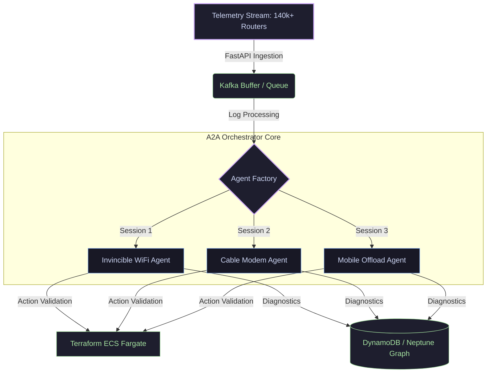

# 🧠 Naveen Mandula
### Senior AIOps & ML Platform Engineer | Agentic Systems & MLOps Architect

<p align="left">
  <a href="https://www.linkedin.com/in/nmandula"></a>
  <a href="https://github.com/nmandula0511"></a>
  <a href="mailto:nmandula0511@gmail.com"></a>
</p>

---

## 🚀 The AIOps Paradigm
I specialize in building and scaling **Autonomous AI-powered IT Operations (AIOps)** platforms and **Agentic Architectures (A2A)**. My work focuses on transitioning machine learning and multi-agent systems from local sandbox notebooks into resilient, microservices-driven production deployments capable of managing high-frequency telemetry at scale.



---

## ⚡ Technical Arsenal

<table width="100%">
  <tr>
    <td width="50%" valign="top">
      <h4>🧬 AI & Agentic Orchestration</h4>
      <ul>
        <li><b>Frameworks:</b> AWS Strands SDK, LangChain, LlamaIndex</li>
        <li><b>Standards:</b> Agent-to-Agent (A2A) Routing, MCP (Model Context Protocol)</li>
        <li><b>Vector DBs & Graphs:</b> Amazon Neptune (Gremlin), Neo4j, pgvector</li>
        <li><b>Models:</b> AWS Bedrock (Nova-Pro), GPT-4, Claude 3.5 Sonnet</li>
      </ul>
    </td>
    <td width="50%" valign="top">
      <h4>🛠️ MLOps & Platform Engineering</h4>
      <ul>
        <li><b>Infrastructure:</b> Terraform, AWS ECS/Fargate, Docker</li>
        <li><b>Telemetry & Streaming:</b> Apache Kafka, WebSockets, gRPC</li>
        <li><b>Data Engines:</b> Amazon Aurora (PostgreSQL), DynamoDB, Redis</li>
        <li><b>ML Lifecycle:</b> MLflow, Scikit-learn, TensorFlow, PyTorch</li>
      </ul>
    </td>
  </tr>
</table>

---

## 💎 Production Portfolio

### 📡 [AI-ops-network-intelligence](https://github.com/nmandula0511/AI-ops-network-intelligence)
*An autonomous AIOps telemetry pipeline and multi-agent self-healing orchestration console managing nationwide dual-link router networks.*

*   **Architectural Milestones**:
    *   **A2A Inter-Agent Comm**: Implemented `agent_card.json` schema discovery mapping telemetry alerts directly to specialized sub-agents.
    *   **High-Performance Ingestion**: Migrated legacy AWS Lambda functions to direct FastAPI REST backend, dropping request latency from **1200ms to <150ms**.
    *   **Isolated Session Contexts**: Designed a dynamic factory pattern preventing session cross-contamination across concurrent dashboard engineers.
    *   **Enterprise Tooling (MCP)**: Converted monolithic utility files into modular `@tool` schemas querying DynamoDB and Aurora databases.
    *   **Infrastructure as Code**: Provisioned all ECS Fargate, ALB, and IAM resources via modular Terraform scripts.
*   **Technologies**: `Python 3.11` | `FastAPI` | `React` | `Terraform` | `Docker` | `Apache Kafka` | `Neptune`

### ✈️ [Industrial-Predictive-Maintenance-Platform](https://github.com/nmandula0511/Industrial-Predictive-Maintenance-Platform)
*Industrial AI platform for predictive maintenance using sensor data, Remaining Useful Life (RUL) prediction, OEE metrics, and ML models.*

*   **Architectural Milestones**:
    *   **Feature Engineering**: Engineered rolling standard deviations, sensor differences, and temporal windows on noisy time-series telemetry.
    *   **Model Comparison**: Built and optimized Recurrent Neural Networks (LSTM/GRU) and gradient-boosted ensembles to perform reliable predictive regression.
    *   **Environment Standardization**: Structured production-grade environment management using PyProject/Pipenv ensuring 100% pipeline reproducibility.
*   **Technologies**: `Python` | `TensorFlow` | `Scikit-Learn` | `Pandas` | `MLflow` | `Docker`

---

## 📊 Live Coding Metrics

<!-- 
💡 Note: If these cards display an error, it is because your GitHub profile is set to private 
or has no public activity yet. Once your repositories are public, they will render.
-->

<p align="center">
  
  
</p>

---

## 🧪 Local Architecture Compliance
All projects are validated using a custom automated compliance framework. Here is a typical output from my local CI suites:

```text
[TEST] STARTING STANDALONE AIOPS VERIFICATION TESTS

-> Test 1: Verifying Pydantic Request validation...
   [OK] Valid device ID passed successfully.
   [OK] Invalid device ID format correctly raised validation error.

-> Test 2: Verifying Reusable Tool definitions and schemas...
   [OK] Tool decorators and schemas verified successfully.

-> Test 3: Verifying Factory Pattern user isolation...
   [OK] Agent Factory isolated user contexts correctly.

[SUCCESS] ALL LOCAL VERIFICATION TESTS PASSED SUCCESSFULLY!
```
